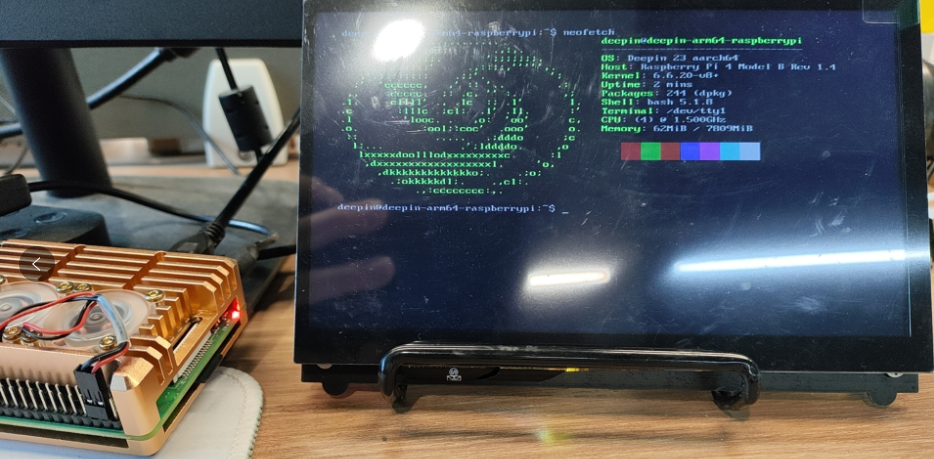
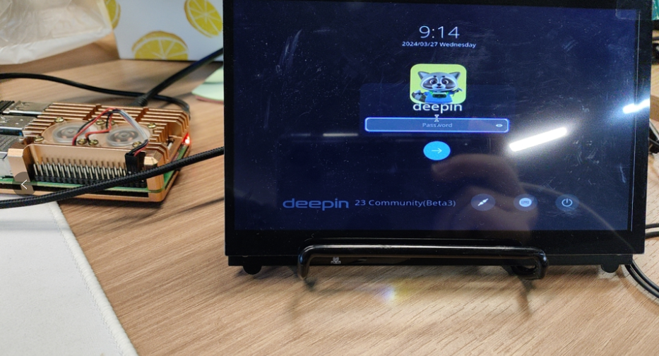
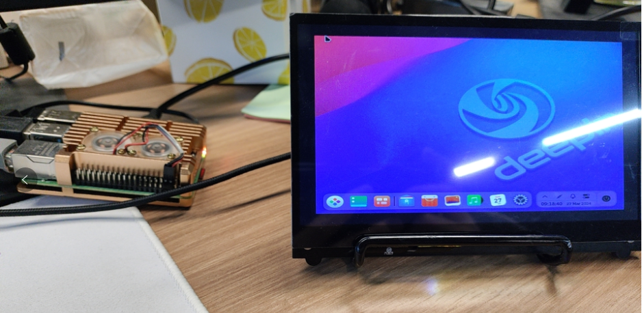

# 介绍

树莓派运行 deepin 系统。

# 构建内核

内核可以从官方 [raspberrypi/firmware](https://github.com/raspberrypi/firmware) 仓库的 boot 目录下拷贝。

安装工具，这里选择交叉编译

```bash
sudo apt install git bc bison flex libssl-dev make libc6-dev libncurses5-dev
```

为 64 位内核安装 64 位工具链

```bash
sudo apt install git bc bison flex libssl-dev make libc6-dev libncurses5-dev
```

克隆代码

```bash
git clone --depth=1 https://github.com/raspberrypi/linux
```

根据 Raspberry Pi 型号运行以下命令来准备默认配置。

这里用树莓派 4B

```bash
cd linux
KERNEL=kernel8
make ARCH=arm64 CROSS_COMPILE=aarch64-linux-gnu- bcm2711_defconfig
```
树莓派5本机编译则为：
```bash
cd linux
KERNEL=kernel_2712
make bcm2712_defconfig
```
使用配置构建，对于所有 64 位版本

```bash
make -j$(nproc) ARCH=arm64 CROSS_COMPILE=aarch64-linux-gnu- Image dtbs modules
```

# 分区

用读卡器将 SD 插入电脑，用 `lsblk` 识别设备。后面的操作和插入一个 SD 卡一样。

这里 dd 个磁盘文件，来当作 SD 卡。

```bash
dd if=/dev/zero of=deepin-raspberrypi.img bs=1M count=16384
```

如果是 SD 卡，进行下格式化, lsblk 查看具体设备。

如果分区被挂载了需要卸载 `sudo umount /media/xxx`, 用 fdisk 删除下已有的分区，下面是对磁盘进行分区， SD 卡同理。

```bash
sudo fdisk deepin-raspberrypi.img << EOF
n
p
1

+300M
t
c
n
p
2


w
EOF
```

挂载

```bash
DEV=$(sudo losetup --partscan --find --show deepin-raspberrypi.img)
```

```bash
sudo mkfs.fat -F32 "${DEV}p1"
sudo mkfs.ext4 "${DEV}p2" # 根分区 (/)
```

# 拷贝根文件系统和引导

```bash
mkdir /mnt/rootfs
ROOTFS="/mnt/rootfs"
sudo mount "${DEV}p2" $ROOTFS

# 根文件系统
./build-rootfs.sh
sudo mount "${DEV}p1" $ROOTFS/boot

# 在物理设备上需要添加 cmdline.txt 定义 Linux内核启动时的命令行参数

PTUUID=$(sudo blkid /dev/loop0 | awk -F'PTUUID="' '{print $2}' | awk -F'"' '{print $1}')
echo "console=serial0,115200 console=tty1 root=PARTUUID=$PTUUID-02 rootfstype=ext4 elevator=deadline fsck.repair=yes rootwait quiet init=/usr/lib/raspi-config/init_resize.sh" | sudo tee $ROOTFS/boot/cmdline.txt

# 拷贝引导加载程序/GPU 固件等, 从 https://github.com/raspberrypi/firmware/tree/master/boot 官方仓库中拷贝，另外放入了 cmdline.txt 和 config.txt 配置

sudo cp -r firmware/* $ROOTFS/boot
```

## 额外的包

```bash
# deepin 源里目前没有 raspi-config 这个包，需要另外下载
sudo mount --bind /dev $ROOTFS/dev
sudo mount -t proc none $ROOTFS/proc
sudo mount -t sysfs none $ROOTFS/sys

sudo chroot $ROOTFS bash

# 进入根文件系统
curl http://archive.raspberrypi.org/debian/pool/main/r/raspi-config/raspi-config_20240313_all.deb -o raspi-config.deb
apt install ./raspi-config.deb
rm ./raspi-config.deb

# 退出系统
exit
```

## 编辑分区表

```bash
PTUUID=$(sudo blkid /dev/loop0 | awk -F'PTUUID="' '{print $2}' | awk -F'"' '{print $1}')
sudo tee $ROOTFS/etc/fstab << EOF
proc            /proc           proc    defaults          0       0
PARTUUID=$PTUUID-01  /boot           vfat    defaults          0       2
PARTUUID=$PTUUID-02  /               ext4    defaults,noatime  0       1
EOF
```

# 启动

## 尝试使用 qemu 启动

下面使用的内核和设备树是我编译的，也可以直接拷贝 firmware 中的 kernel.img 和 bcm2710-rpi-3-b.dtb

```bash
qemu-system-aarch64 -machine type=raspi3b \
	-m 1G  -dtb ~/code/raspberrypi/linux/arch/arm64/boot/dts/broadcom/bcm2710-rpi-3-b.dtb \
	-kernel ~/code/raspberrypi/linux/arch/arm64/boot/Image \
	-drive id=hd-root,format=raw,file=deepin-raspberrypi.img \
	-append "rw earlycon=pl011,0x3f201000 console=ttyAMA0 console=ttyS0,115200 loglevel=8 root=/dev/mmcblk0p2 fsck.repair=yes net.ifnames=0 rootwait memtest=1 dwc_otg.fiq_fsm_enable=0" \
	-serial stdio \
	-netdev user,id=net0,net=10.0.2.0/24,hostfwd=tcp::8022-:22 \
	-usb -device usb-kbd -device usb-tablet -device usb-net,netdev=net0
```

## 从 SD 卡启动

直接将 SD 插入树莓派，通电，插入显示屏，无需额外操作。



# 安装桌面环境

arm 的稳定源可能缺一些包，先添加上构建用的 ci

```bash
sudo vim /etc/apt/sources.list
```

```bash
deb [trusted=yes] https://ci.deepin.com/repo/obs/deepin:/Develop:/main/standard/ ./
deb-src [trusted=yes] https://ci.deepin.com/repo/obs/deepin:/Develop:/main/standard/ ./
deb [trusted=yes] https://ci.deepin.com/repo/obs/deepin:/Develop:/community/deepin_develop/ ./
deb-src [trusted=yes] https://ci.deepin.com/repo/obs/deepin:/Develop:/community/deepin_develop/ ./
deb [trusted=yes] https://ci.deepin.com/repo/obs/deepin:/Develop:/dde/deepin_develop/ ./
deb-src [trusted=yes] https://ci.deepin.com/repo/obs/deepin:/Develop:/dde/deepin_develop/ ./
```

```bash
sudo apt update && sudo apt upgrade
```

```bash
sudo apt install deepin-desktop-environment-base
sudo apt install deepin-desktop-environment-cli
sudo apt install deepin-desktop-environment-core
sudo apt install deepin-desktop-environment-extras
sudo apt install deepin-desktop-environment-ll
```

安装完重启树莓派。





完结撒花。

# 参考

[QEMU仿真树莓派1和3B-保姆级教程](https://zhuanlan.zhihu.com/p/452590356?utm_id=0)

[raspberrypi document0ation](https://www.raspberrypi.com/documentation/computers/linux_kernel.html?spm=5176.28103460.0.0.247d3f99dF96wJ&file=updating.md)
